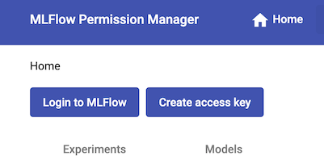
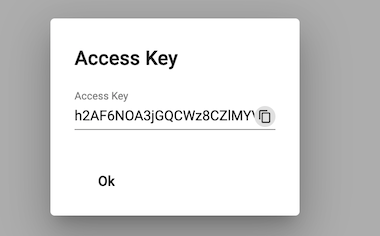

# Basic Auth

To use Basic authentication with your notebooks you need to generate access token



Do not forget to copy personal access token to safe place.



## PAT usage example

```python
import mlflow
from mlflow import log_metric, log_param

tracking_server_url = "https://mlflow.technicaldomain.xyz"
username = "<email>"
password = "<token>"

mlflow.set_tracking_uri(tracking_server_url)
mlflow.set_experiment("demo_experiment")

import os
os.environ["MLFLOW_TRACKING_USERNAME"] = username
os.environ["MLFLOW_TRACKING_PASSWORD"] = password

with mlflow.start_run(run_name="demo_run"):
    log_param("param1", 5)
    log_param("param2", "test_param")
    log_metric("metric1", 0.1)
    log_metric("metric2", 0.2)
    print("Experiment data logged successfully!")
```
